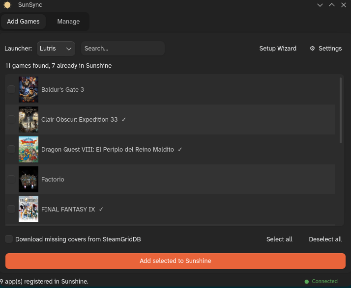

# SunSync

Adds your Lutris, Steam, Heroic and other launcher games to [Sunshine](https://app.lizardbyte.dev/Sunshine/) so you can stream them with Moonlight. It has a small PyQt6 GUI and a CLI, pulls cover art from your local library, and can spin up a virtual monitor that matches the resolution your phone or tablet asks for (and turns your real monitors off while you play).

Built for **KDE Plasma Wayland**, where Sunshine runs with `capture=kwin`.



## What it does

- Lists games from your installed launchers and adds the ones you pick to Sunshine.
- Reuses the cover art already on your disk (Lutris/Steam), falling back to SteamGridDB if you give it an API key.
- Re-adding a game updates the existing Sunshine entry instead of making a duplicate.
- Optionally attaches start/stop scripts to each game that create a virtual display while streaming.

## How it works

SunSync sits between your local launchers and Sunshine's REST API:

```
  Launcher sources              SunSync                      Sunshine
  ----------------         -------------------            --------------
  Lutris  (SQLite) \
  Steam   (VDF)     \   detect -> list games
  Heroic  (JSON)     >  resolve cover art       --->   POST /api/apps
  Bottles/RetroArch /   build safe launch cmd          (add or update,
  ...and more      /    + virtual-display prep-cmd      deduplicated)
```

Launcher modules read each library and build a launch command; cover art comes from your local files first; and if virtual-display scripts are configured they ride along on every entry as prep-cmd.

## Supported launchers

Lutris, Steam, Heroic, Bottles, Faugus, Ryubing, RetroArch, Eden. Native, Flatpak and AppImage installs are detected where they apply.

## Install

Needs Python 3.11+ and Sunshine running on the same machine.

**Arch / CachyOS (AUR):**

```bash
paru -S sunsync      # or yay -S sunsync
```

That adds SunSync to your app menu and installs `sunsync` (CLI) and `sunsync-gui` (GUI).

**From source:**

```bash
git clone https://github.com/OscarTienda/SunSync.git
cd SunSync

# Arch, using system packages:
sudo pacman -S python python-pyqt6 python-requests python-pillow
python sunsync.py --gui

# or with uv:
uv sync && uv run python sunsync.py --gui

# or with pip:
pip install -r requirements.txt && python sunsync.py --gui
```

The virtual display also needs `krfb`, `libkscreen` and `qt6-tools`.

## Using it

Start Sunshine, then run `python sunsync.py --gui` (or `sunsync-gui`). The setup wizard walks you through connecting to Sunshine, logging in, and the optional virtual display. After that, pick a launcher, select games, and click **Add selected to Sunshine**.

Close Lutris before scanning, otherwise its database is locked.

The CLI does the same thing without a window:

```bash
python sunsync.py            # interactive
python sunsync.py --all      # add everything
python sunsync.py list       # list apps already in Sunshine
python sunsync.py remove "Game Name"   # remove an app by name
```

`--cover` downloads SteamGridDB art, `--sunshine-host`/`--sunshine-port` point at a non-default server.

## Virtual display

Streaming a game on its own virtual screen means Sunshine can capture it at exactly the resolution your Moonlight client requested, and your physical monitors can stay off. Sunshine passes the client's width, height and fps to the prep scripts; the start script creates a matching `krfb-virtualmonitor` output, switches it to that mode with `kscreen-doctor`, and disables the connected physical outputs. The stop script puts everything back when you quit the game.

The wizard can set this up for you (**Generate default scripts**). To do it by hand, the scripts are in [`scripts/`](scripts/):

```bash
install -Dm755 scripts/sunshine-start-vmon.sh ~/.local/bin/sunshine-start-vmon.sh
install -Dm755 scripts/sunshine-stop-vmon.sh  ~/.local/bin/sunshine-stop-vmon.sh

python sunsync.py display external-prep set \
  --do ~/.local/bin/sunshine-start-vmon.sh \
  --undo ~/.local/bin/sunshine-stop-vmon.sh
```

Then set this in `~/.config/sunshine/sunshine.conf` and restart Sunshine:

```
capture = kwin
output_name = Virtual-sunshine-vmon
```

The scripts detect which physical outputs to turn off on their own, so they work the same on one monitor or several.

## Credentials & privacy

SunSync only talks to your local Sunshine and, if you ask it to, SteamGridDB. No telemetry. Your Sunshine login is cached under `~/.config/sunshine/credentials/` with owner-only permissions; nothing is stored in a system keyring or KDE Wallet. You can point it at a remote Sunshine host, but it'll warn you first, since Sunshine's certificate is self-signed and the traffic isn't verified.

## Troubleshooting

- **Won't connect** — check Sunshine is running and the port matches (default 47990); use **Test Connection** in the wizard.
- **Login fails** — use the credentials you set when configuring Sunshine.
- **No games listed** — close Lutris before scanning; make sure Heroic/Steam have run at least once.
- **Virtual display doesn't start** — check `which krfb-virtualmonitor` and that the scripts in `~/.local/bin` are executable.

## Layout

```
sunsync.py            CLI
gui.py                PyQt6 GUI
launchers/            one module per launcher
sunshine/sunshine.py  Sunshine REST API
utils/                cover art, SteamGridDB, helpers
display/manager.py    prep-cmd state
scripts/              virtual-monitor scripts
packaging/            AUR PKGBUILD
```

## License

[MIT](LICENSE). Started as a fork of [LutrisToSunshine](https://github.com/Arbitrate3280/LutrisToSunshine) by Arbitrate3280, reworked for KDE Plasma Wayland. The virtual-display approach follows [this r/MoonlightStreaming write-up](https://www.reddit.com/r/MoonlightStreaming/comments/1sp8l9q/sunshine_moonlight_fully_working_on_kde_plasma/).
